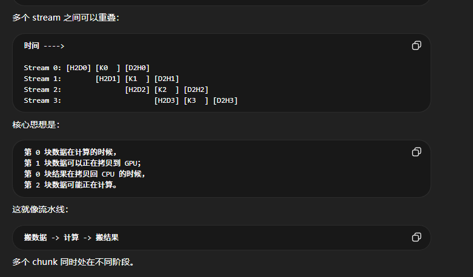
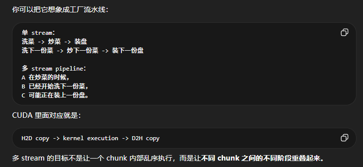

# Cuda

#### 教程：https://colab.research.google.com/github/NVIDIA/accelerated-computing-hub/blob/main/tutorials/cuda-cpp/notebooks/

#### 核心： 加速库，GPU高内存带宽，并行训练，延迟隐藏

cuda就是利用GPU的高额带宽，来减少不必要的空间损失，进而提升效率

```c++
std::transform(first,last,result,op);
```


CUDA Compiler 编译后-> fma.rn.f32

### 执行空间

指定哪些代码应该在GPU上面运行


### 通用向量

````c++
thrust::universal_vector<float> // 通用向量可以在CPU和GPU上面使用
							    //一个长得像 std::vector<float> 的动态数组，但底层数据放在 CUDA 的统一内存里，CPU 和 GPU 都能访问。
````

### 如何控制代码在哪个执行空间中编译

```c++
__host__ // 指的是在CPU上面运行
__device__ // 指的是在GPU上面运行
```


#### exercise 1


Thrust 可以理解成 **CUDA 版、并行版、偏 STL 风格的算法库**。你用它时，思路通常不是“自己手写 kernel”，而是把问题拆成几类标准操作：遍历、变换、归约、扫描、排序、重排、查找。真正常用的函数，其实就集中在这些类型里。

如果你现在在学 CUDA，最该先掌握的不是一大堆 API 名字，而是先建立一个判断框架：

**一个数组问题，到底属于变换、归约、扫描、排序，还是重排。**
 一旦问题类型判断对了，Thrust 的函数就很好选。

先说最基础的容器。最常见的是 `thrust::host_vector`、`thrust::device_vector` 和你前面接触过的 `thrust::universal_vector`。它们分别对应主机内存、设备内存、统一内存。初学时你会经常看到：

```c++
thrust::host_vector<int> h(10);
thrust::device_vector<int> d = h;
```

这表示把 CPU 上的数据拷到 GPU 容器里。`device_vector` 是最经典的，`universal_vector` 更方便，但你别太依赖它，因为它把很多内存迁移细节藏起来了，学底层时容易学虚。

然后是最核心的一组：**变换类函数**。
 最常用的是 `thrust::transform`。它的作用和 STL 里的 `std::transform` 很像，就是对每个元素按规则变换。比如：

```c++
thrust::transform(thrust::device,
                  a.begin(), a.end(),
                  b.begin(),
                  [] __host__ __device__ (float x) {
                      return x * 2.0f;
                  });
```

这是一元变换，把 `a` 里的每个元素乘 2 后写到 `b`。如果是两个输入序列一起处理，那就是二元版本，比如逐元素相加：

```c++
thrust::transform(thrust::device,
                  a.begin(), a.end(),
                  b.begin(),
                  c.begin(),
                  [] __host__ __device__ (float x, float y) {
                      return x + y;
                  });
```

你以后看到“逐元素加、减、乘、绝对值、阈值裁剪、归一化”这类问题，第一反应就该想到 `transform`。

和它很像的是 `thrust::for_each`。这个函数也是遍历每个元素，但更偏向“执行某种副作用操作”，而不是“把结果写到新数组”。比如打印、累积某种状态、对 tuple 做处理。它比 `transform` 更自由，但也更容易写出不清晰的代码。一般来说，**能用 `transform` 表达映射关系时，就别优先用 `for_each`**。

接下来是第二大类：**归约类函数**。
 最常用的是 `thrust::reduce`。它把一整个序列压成一个值，比如求和、求最大值、求最小值。比如求和：

```c++
float sum = thrust::reduce(thrust::device, a.begin(), a.end(), 0.0f, thrust::plus<float>());
```

求最大值：

```c++
float mx = thrust::reduce(thrust::device, a.begin(), a.end(), -1e30f, thrust::maximum<float>());
```

很多人第一次学 Thrust 时，只会 `transform` 和 `reduce` 分开写。但更实用的是 `thrust::transform_reduce`。它的意思是：**先对每个元素做变换，再直接归约，不生成中间数组**。比如你前面那个“求最大绝对差”的朴素写法，就可以用 `transform_reduce` 优化掉中间差值向量。这类函数很值钱，因为它更贴近性能思维。

第三大类是 **扫描类函数**，也就是 prefix sum。最常见的是 `inclusive_scan` 和 `exclusive_scan`。
 如果输入是：

```
1 2 3 4
```

那么 `inclusive_scan` 结果是：

```
1 3 6 10
```

而 `exclusive_scan` 结果通常是：

```
0 1 3 6
```

这组函数特别重要，因为很多看起来复杂的并行问题，本质上都绕不开前缀和。比如流压缩、分块定位、构建偏移量、稀疏索引、桶排序辅助步骤。你现在可能觉得这玩意抽象，但后面会越来越常见。

第四大类是 **排序和按键排序**。
 普通排序就是 `thrust::sort`：

```c++
thrust::sort(thrust::device, a.begin(), a.end());
```

如果你有一组 key 和一组 value，希望按 key 排序，同时把 value 跟着一起重排，就用 `thrust::sort_by_key`：

```c++
thrust::sort_by_key(thrust::device, keys.begin(), keys.end(), values.begin());
```

这个非常常用。比如你有分数和对应编号，想按分数排序，但还得保留原始编号，那就该用它。还有 `stable_sort` 和 `stable_sort_by_key`，稳定性的意思是：相同 key 的相对顺序保持不变。

第五大类是 **拷贝、填充、生成、计数**。
 这些函数名字都很直白，比如：

`thrust::copy`：拷贝区间。
 `thrust::fill`：把一个区间全填成某个值。
 `thrust::sequence`：生成连续序列，例如 0,1,2,3,...
 `thrust::count` 和 `thrust::count_if`：统计某个值或满足条件的元素数量。

比如：

```c++
thrust::sequence(thrust::device, a.begin(), a.end());      // 0,1,2,3,...
thrust::fill(thrust::device, a.begin(), a.end(), 7);       // 全部填 7
int c = thrust::count(thrust::device, a.begin(), a.end(), 7);
```

这些函数虽然看起来“基础”，但在原型开发里特别好用，比你自己写循环干净得多。

第六大类是 **查找和逻辑判断**。
 常见的有 `find`、`find_if`、`binary_search`、`lower_bound`、`upper_bound`。
 如果数据已经有序，`lower_bound` 和 `upper_bound` 非常有用。比如你想找某个值该插在哪儿、某个范围对应的区间边界，它们就是标准答案。

第七大类是 **删除、筛选、分区**。
 比如 `remove`、`remove_if`、`copy_if`、`partition`。
 这组函数适合做“保留符合条件的元素”“去掉无效值”“把满足条件的放前面”这种任务。比如：

```c++
auto new_end = thrust::remove_if(thrust::device, a.begin(), a.end(),
                                 [] __host__ __device__ (int x) {
                                     return x < 0;
                                 });
```

这表示把负数移走，返回新的逻辑末尾。要注意，这类函数往往只是“逻辑上收缩区间”，不一定真的帮你缩容。

第八大类是 **重排类函数**，这一组很值得你认真记住。
 最常见的是 `gather` 和 `scatter`。

`gather` 的意思是：
 根据一组索引，从源数组里“按索引取值”，收集到目标数组。

`scatter` 的意思是：
 根据一组索引，把源数组里的值“按索引写到目标位置”。

如果你以后做重排序、索引映射、稀疏结构、按指定次序采样，这两个函数会非常顺手。
 还有一个常见的是 `permutation_iterator`，它本质上也是一种按索引重排访问的思路。

除了算法，Thrust 还有一类非常关键的工具：**迭代器**。
 如果你只会 `device_vector` 和 `transform`，你其实还只学了一半。Thrust 真正有威力的地方在于，它允许你用特殊迭代器把“数据视图”拼出来，而不是总去真的创建新数组。

最常见的几个是：

`counting_iterator`：不存数组，直接把一串整数当成迭代器来用。
 `zip_iterator`：把多个序列打包成一个 tuple 序列一起遍历。
 `transform_iterator`：访问时自动变换，不真的生成变换后的数组。
 `permutation_iterator`：按索引映射访问别的序列。

比如 `zip_iterator` 很适合同时处理两个或多个数组：

```c++
auto begin = thrust::make_zip_iterator(thrust::make_tuple(a.begin(), b.begin()));
```

这样每次迭代拿到的就是 `(a[i], b[i])` 这样的 tuple。你前面遇到的 `print`、`make_zip_iterator`，本质就是这一类东西。

还有一个你必须习惯的点：**执行策略**。
 Thrust 里很多函数前面会写：

```c++
thrust::device
thrust::host
```

这不是装饰，这是在明确告诉算法在哪执行。
 比如：

```c++
thrust::sort(thrust::device, a.begin(), a.end());
```

表示在 GPU 上排序。
 如果写 `thrust::host`，就是在 CPU 上跑。

你前面已经碰到过这个问题了：**内存能不能在 CPU/GPU 都访问，不等于算法会自动选你想要的执行位置。** 所以执行策略要有意识地写清楚。

如果要给你压缩成最值得先掌握的一小撮，我会直接说这 12 个最常用：

`device_vector`，`transform`，`for_each`，`reduce`，`transform_reduce`，`inclusive_scan`，`exclusive_scan`，`sort`，`sort_by_key`，`copy_if`，`gather`，`sequence`。

你把这几个吃透，已经够你做不少实际东西了。

最后我给你一个实战判断法。以后看到一个问题时，先别急着写 kernel，先问自己：

如果是“每个元素独立变一下”，用 `transform`。
 如果是“整个数组压成一个值”，用 `reduce`。
 如果是“先变换再压缩”，用 `transform_reduce`。
 如果是“做前缀累计”，用 `scan`。
 如果是“按大小重排”，用 `sort`。
 如果是“按索引取值或写值”，用 `gather/scatter`。
 如果是“删掉不符合条件的元素”，用 `remove_if/copy_if`。
 如果是“多个数组绑在一起处理”，用 `zip_iterator`。

这才是学 Thrust 的正路。不是背函数，而是形成“问题类型 → 算法原语”的映射。

## 手写CUDA Kernel 和 Thrust

一、变换：最简单，1 个线程处理 1 个元素

比如把数组每个元素乘 2。

#### 1）手写 CUDA kernel

```c++
#include <cuda_runtime.h>
#include <iostream>

__global__ void transform_kernel(const float* in, float* out, int n) {
    int i = blockIdx.x * blockDim.x + threadIdx.x;
    if (i < n) {
        out[i] = in[i] * 2.0f;
    }
}

int main() {
    int n = 1024;
    size_t bytes = n * sizeof(float);

    float* h_in = new float[n];
    float* h_out = new float[n];
    for (int i = 0; i < n; ++i) h_in[i] = i;

    float *d_in, *d_out;
    cudaMalloc(&d_in, bytes);
    cudaMalloc(&d_out, bytes);

    cudaMemcpy(d_in, h_in, bytes, cudaMemcpyHostToDevice);

    int block = 256;
    int grid = (n + block - 1) / block;
    transform_kernel<<<grid, block>>>(d_in, d_out, n);

    cudaMemcpy(h_out, d_out, bytes, cudaMemcpyDeviceToHost);
    cudaDeviceSynchronize();

    std::cout << h_out[10] << std::endl;

    cudaFree(d_in);
    cudaFree(d_out);
    delete[] h_in;
    delete[] h_out;
    return 0;
}
```

#### 2）用 Thrust

```c++
#include <thrust/device_vector.h>
#include <thrust/transform.h>
#include <iostream>

struct TimesTwo {
    __host__ __device__
    float operator()(float x) const {
        return x * 2.0f;
    }
};

int main() {
    thrust::device_vector<float> d_in(1024);
    thrust::device_vector<float> d_out(1024);

    thrust::sequence(d_in.begin(), d_in.end(), 0);

    thrust::transform(d_in.begin(), d_in.end(), d_out.begin(), TimesTwo());

    std::cout << d_out[10] << std::endl;
    return 0;
}
```

变换类任务的基本模板就是：

```c++
int i = blockIdx.x * blockDim.x + threadIdx.x;
if (i < n) out[i] = f(in[i]);
```

下面给你一份 **Thrust 常用函数速查表**。我不搞大而全，直接按你现阶段最有用的那几类来整理：**干什么、什么时候用、最小示例、你要注意什么**。

------

1. #### thrust::transform

作用：**逐元素变换**

适合场景：
 一个数组每个元素做同样操作，或者两个数组逐元素组合。

##### 一元版本

```c++
thrust::transform(thrust::device,
                  a.begin(), a.end(),
                  b.begin(),
                  [] __host__ __device__ (float x) {
                      return x * 2.0f;
                  });
```

含义：
 把 `a[i] * 2` 写到 `b[i]`

##### 二元版本

```c++
thrust::transform(thrust::device,
                  a.begin(), a.end(),
                  b.begin(),
                  c.begin(),
                  [] __host__ __device__ (float x, float y) {
                      return x + y;
                  });
```

含义：
 把 `a[i] + b[i]` 写到 `c[i]`

------

#### 2. `thrust::for_each`

作用：**遍历每个元素执行操作**

适合场景：
 你不是单纯要“生成一个新数组”，而是想对每个元素做某种处理。

```c++
thrust::for_each(thrust::device,
                 a.begin(), a.end(),
                 [] __host__ __device__ (int x) {
                     printf("%d\n", x);
                 });
```

------

#### 3. `thrust::reduce`

作用：**把整个序列压成一个值**

适合场景：
 求和、求最大值、求最小值。

##### 求和

```c++
float sum = thrust::reduce(thrust::device,
                           a.begin(), a.end(),
                           0.0f,
                           thrust::plus<float>());
```

##### 求最大值

```c++
float mx = thrust::reduce(thrust::device,
                          a.begin(), a.end(),
                          -1e30f,
                          thrust::maximum<float>());
```

------

#### 4. `thrust::transform_reduce`

作用：**先变换，再归约**

适合场景：
 你不想先生成中间数组，再做 reduce。

##### 例子：求平方和

```c++
float result = thrust::transform_reduce(
    thrust::device,
    a.begin(), a.end(),
    [] __host__ __device__ (float x) {
        return x * x;
    },
    0.0f,
    thrust::plus<float>()
);
```

------

#### 5. `thrust::inclusive_scan`

作用：**前缀和，包含当前元素**

输入：

```
1 2 3 4
```

输出：

```c++
1 3 6 10
thrust::inclusive_scan(thrust::device,
                       a.begin(), a.end(),
                       b.begin());
```

------

#### 6. `thrust::exclusive_scan`

作用：**前缀和，不包含当前元素**

输入：

```
1 2 3 4
```

输出：

```c++
0 1 3 6
thrust::exclusive_scan(thrust::device,
                       a.begin(), a.end(),
                       b.begin());
```

------

#### 7. `thrust::sort`

作用：**排序**

```c++
thrust::sort(thrust::device, a.begin(), a.end());
```

------

#### 8. `thrust::sort_by_key`

作用：**按 key 排序，同时带动 value 一起重排**

```c++
thrust::sort_by_key(thrust::device,
                    keys.begin(), keys.end(),
                    values.begin());
```

##### 例子理解

如果：

```
keys   = [30, 10, 20]
values = [A,  B,  C ]
```

排序后变成：

```
keys   = [10, 20, 30]
values = [B,  C,  A ]
```

------

#### 9. `thrust::copy`

作用：**拷贝区间**

```c++
thrust::copy(thrust::device,
             a.begin(), a.end(),
             b.begin());
```

------

#### 10. `thrust::fill`

作用：**把一个区间全填成同一个值**

```c++
thrust::fill(thrust::device,
             a.begin(), a.end(),
             7);
```

结果：
 `a` 里的每个元素都变成 7。

------

#### 11. `thrust::sequence`

作用：**生成连续序列**

```c++
thrust::sequence(thrust::device,
                 a.begin(), a.end());
```

结果可能是：

```
0 1 2 3 4 ...
```

也可以指定起点和步长：

```c++
thrust::sequence(thrust::device,
                 a.begin(), a.end(),
                 10, 2);
```

结果：

```
10 12 14 16 ...
```

------

#### 12. `thrust::count` / `thrust::count_if`

作用：**计数**

##### 统计某个值出现多少次

```c++
int cnt = thrust::count(thrust::device,
                        a.begin(), a.end(),
                        7);
```

##### 统计满足条件的元素个数

```c++
int cnt2 = thrust::count_if(thrust::device,
                            a.begin(), a.end(),
                            [] __host__ __device__ (int x) {
                                return x > 0;
                            });
```

------

#### 13. `thrust::find` / `thrust::find_if`

作用：**查找元素**

##### 找某个值

```c++
auto it = thrust::find(thrust::device,
                       a.begin(), a.end(),
                       5);
```

##### 找满足条件的第一个元素

```c++
auto it2 = thrust::find_if(thrust::device,
                           a.begin(), a.end(),
                           [] __host__ __device__ (int x) {
                               return x % 2 == 0;
                           });
```

------

#### 14. `thrust::remove_if`

作用：**删除满足条件的元素（逻辑删除）**

```c++
auto new_end = thrust::remove_if(thrust::device,
                                 a.begin(), a.end(),
                                 [] __host__ __device__ (int x) {
                                     return x < 0;
                                 });
```

------

#### 15. `thrust::copy_if`

作用：**筛选符合条件的元素到新数组**

```c++
auto end = thrust::copy_if(thrust::device,
                           a.begin(), a.end(),
                           b.begin(),
                           [] __host__ __device__ (int x) {
                               return x > 0;
                           });
```

------

#### 16. `thrust::gather`

作用：**按索引取值**

```c++
thrust::gather(thrust::device,
               map.begin(), map.end(),
               src.begin(),
               dst.begin());
```

##### 例子

如果：

```
src = [10, 20, 30, 40]
map = [2, 0, 3]
```

结果：

```
dst = [30, 10, 40]
```

------

#### 17. `thrust::scatter`

作用：**按索引写值**

```c++
thrust::scatter(thrust::device,
                src.begin(), src.end(),
                map.begin(),
                dst.begin());
```

##### 例子

如果：

```c++
src = [100, 200, 300]
map = [2, 0, 3]
```

结果会把：

- `src[0]` 写到 `dst[2]`
- `src[1]` 写到 `dst[0]`
- `src[2]` 写到 `dst[3]`

------

### 常用迭代器

这些不是函数，但非常重要。

#### 18. `thrust::make_zip_iterator`

作用：**把多个序列绑在一起遍历**

```c++
auto begin = thrust::make_zip_iterator(
    thrust::make_tuple(a.begin(), b.begin())
);
```

这样每次访问的就是一个 tuple：

```c++
(thrust::get<0>(t), thrust::get<1>(t))
```

------

#### 19. `thrust::counting_iterator`

作用：**不存数组，直接生成连续整数迭代器**

```c++
auto first = thrust::make_counting_iterator(0);
auto last  = thrust::make_counting_iterator(10);
```

这相当于一个虚拟序列：

```
0 1 2 3 4 5 6 7 8 9
```

------

#### 20. `thrust::make_transform_iterator`

作用：**访问时自动变换，不真实生成中间数组**

这个更高级，先知道有它就行。
 它的意义是：**把 transform 延迟到访问时发生。**

------

##### 执行策略

这是 Thrust 非常关键的一点。

#### `thrust::device`

表示在 GPU 侧执行：

```c++
thrust::sort(thrust::device, a.begin(), a.end());
```

#### `thrust::host`

表示在 CPU 侧执行：

```c++
thrust::sort(thrust::host, a.begin(), a.end());
```

### 你要记住

**容器在哪，不等于算法就一定在哪执行。**
 执行位置要看执行策略。


在 CUDA 编程模型里，`thread`、`block`、`grid` 是三个从小到大的执行层级。你可以把它理解成：

- `thread`：最小执行单元，相当于一个“工人”
- `block`：一组 thread 组成的“班组”
- `grid`：一组 block 组成的“工地”

下面直接解释。

### 1. thread

`thread` 是 GPU 上真正执行代码的最小单位。
 你写的 kernel 函数启动后，会有很多个 thread 同时执行同一份代码，但每个 thread 处理的数据通常不同。

例如：

```
__global__ void add(int *a, int *b, int *c) {
    int i = threadIdx.x;
    c[i] = a[i] + b[i];
}
```

这里每个 thread 都执行 `c[i] = a[i] + b[i]`，但 `i` 不一样，所以每个 thread 负责不同位置的数据。

CUDA 里常见的线程索引有：

- `threadIdx.x / y / z`：线程在线程块内的位置
- 一个 block 内的线程可以是一维、二维、三维组织

比如：

```
threadIdx.x
```

表示当前线程在当前 block 里的 x 方向编号。

------

### 2. block

`block` 是若干个 thread 的集合。
 一个 block 内的线程可以：

- 通过 **共享内存** 协作
- 通过 `__syncthreads()` 同步
- 有共同的 block 编号 `blockIdx`

例如：

```
int global_id = blockIdx.x * blockDim.x + threadIdx.x;
```

这里：

- `blockIdx.x`：当前 block 是第几个 block
- `blockDim.x`：每个 block 里有多少个线程
- `threadIdx.x`：当前线程在 block 内编号

所以 `global_id` 就是当前线程在整个 grid 里的全局编号。

#### 为什么要分 block？

因为 GPU 不会把所有线程都放到一个大组里统一管理，而是按 block 分组调度。
 这样有几个作用：

- 方便硬件调度
- 方便线程协作
- 方便扩展到大量数据

#### block 的特点

- block 内线程可以通信和同步
- 不同 block 之间**不能直接同步**
- block 的大小由你指定，例如：

```
dim3 block(256);
```

表示一个 block 有 256 个线程。

------

### 3. grid

`grid` 是一次 kernel 启动时，所有 block 组成的更大集合。
 也就是：**一个 kernel = 一个 grid**

例如：

```
add<<<grid, block>>>(a, b, c);
```

这里：

- `block` 决定每个 block 有多少线程
- `grid` 决定总共有多少个 block

比如：

```
add<<<10, 256>>>(a, b, c);
```

表示：

- 共有 10 个 block
- 每个 block 有 256 个 thread
- 总线程数 = `10 * 256 = 2560`

这些线程一起执行 `add` 这个 kernel。

------

## 三者关系

层级关系是：

```
grid
 ├── block 0
 │    ├── thread 0
 │    ├── thread 1
 │    └── ...
 ├── block 1
 │    ├── thread 0
 │    ├── thread 1
 │    └── ...
 └── ...
```

所以本质上：

```
grid > block > thread
```

------

## 一个直观例子

假设你有 1000 个元素要处理，每个线程处理 1 个元素。

可以这样设置：

```
int N = 1000;
int threadsPerBlock = 256;
int blocksPerGrid = (N + threadsPerBlock - 1) / threadsPerBlock;
kernel<<<blocksPerGrid, threadsPerBlock>>>(...);
```

这里：

- 每个 block 256 个线程
- 需要多少个 block，就按总数据量来算
- 每个线程通过全局索引找到自己负责的数据

典型 kernel 写法：

```
__global__ void kernel(float *a, float *b, float *c, int N) {
    int idx = blockIdx.x * blockDim.x + threadIdx.x;
    if (idx < N) {
        c[idx] = a[idx] + b[idx];
    }
}
```

解释：

- `threadIdx.x`：线程在 block 内编号
- `blockDim.x`：block 的线程数
- `blockIdx.x`：block 在 grid 内编号
- `idx`：线程处理的全局数据编号

------

## 为什么 CUDA 要这样设计

因为 GPU 的核心目标就是：**大规模并行处理**。

如果没有 `block` 和 `grid` 这样的层级，管理几十万、几百万个线程会很混乱。
 这种分层设计可以：

- 让程序员方便描述并行任务
- 让硬件高效调度
- 让代码适配不同规模 GPU

------

## 你需要牢牢记住的几个量

### block 内部相关

- `threadIdx`：线程在当前 block 内的编号
- `blockDim`：当前 block 的尺寸

### grid 层面相关

- `blockIdx`：当前 block 在整个 grid 内的编号
- `gridDim`：整个 grid 里有多少个 block

------

## 最常见的一维情况

一维是最常用的，公式最重要：

```
int idx = blockIdx.x * blockDim.x + threadIdx.x;
```

它表示：
 **当前线程在整个 grid 中的全局线性编号**

这个公式你几乎必须背下来。

------

## 一句话总结

- `thread`：真正干活的最小单位
- `block`：若干 thread 组成，block 内线程可以协作
- `grid`：若干 block 组成，一次 kernel 启动对应一个 grid

你可以把 CUDA 想成：

**grid 把任务分成多个 block，block 再把任务分给多个 thread，每个 thread 去处理一小块数据。**

如果你要，我下一条可以继续给你讲：
 **`threadIdx/blockIdx/blockDim/gridDim` 怎么配合计算二维矩阵下标**。


## 10. 把数据从 CPU 拷到 GPU

```
CHECK_CUDA(cudaMemcpy(d_a, h_a.data(), bytes, cudaMemcpyHostToDevice));
CHECK_CUDA(cudaMemcpy(d_b, h_b.data(), bytes, cudaMemcpyHostToDevice));
```

这两句是把输入数组传到 GPU。

参数顺序是：

```
cudaMemcpy(目标地址, 源地址, 字节数, 拷贝方向)
```

## 你可以把它想成两层组织结构

### 第一层：grid

网格，是很多 block 的集合

### 第二层：block

线程块，是很多 thread 的集合

### 第三层：thread

线程，真正执行计算的最小单位

------

所以关系是：

**grid 包含很多 block，block 包含很多 thread**


## 四、三者关系图

你可以这样理解：

```
Grid
 ├── Block 0
 │    ├── Thread 0
 │    ├── Thread 1
 │    ├── Thread 2
 │    └── ...
 ├── Block 1
 │    ├── Thread 0
 │    ├── Thread 1
 │    ├── Thread 2
 │    └── ...
 ├── Block 2
 │    └── ...
 └── ...
```

## 六、结合 `<<<grid, block>>>` 来理解

你在 CUDA 里启动 kernel 时，常见写法是：

```
kernel<<<gridSize, blockSize>>>(...);
```

比如：

```
kernel<<<3, 4>>>(...);
```

意思就是：

- grid 里有 3 个 block
- 每个 block 里有 4 个 thread

总共就是：

3×4=123 \times 4 = 123×4=12

个线程。

这 12 个线程都会执行 `kernel` 这段代码。


## 十三、一维情况下你最该背的模板

```
__global__ void kernel(...) {
    int idx = blockIdx.x * blockDim.x + threadIdx.x;
    if (idx < n) {
        // 处理第 idx 个元素
    }
}
```

这里：

- `threadIdx.x`：块内编号
- `blockIdx.x`：块编号
- `blockDim.x`：每块线程数
- `idx`：全局编号

这就是 thread、block、grid 在代码里的最经典体现。


## 五、线程也可以做很多次

比如你完全可以写成这样：

```
__global__ void kernel(float* a, int n) {
    int idx = blockIdx.x * blockDim.x + threadIdx.x;
    for (int i = idx; i < n; i += blockDim.x * gridDim.x) {
        a[i] *= 2;
    }
}
```

这时候每个线程就不是只做一次了，而是会处理多个元素。

因为它在 `for` 循环里不断跳着处理：

- 第一次处理 `idx`
- 第二次处理 `idx + 总线程数`
- 第三次处理 `idx + 2 * 总线程数`

这种写法叫 **grid-stride loop**。

所以要分清：

- **你这个例子**：每线程一次加法
- **更一般的 CUDA 程序**：每线程可以做很多次计算

## 1. **内存位置**

### **Global Memory (全局内存)**

- **位置**：全局内存位于 **GPU 的设备端**，是 GPU 上最大的一块内存区域。
- **访问范围**：全局内存对所有线程和 block 可见，任何线程都可以读写全局内存。

### **Shared Memory (共享内存)**

- **位置**：共享内存位于 **每个 Streaming Multiprocessor (SM) 内部**，每个 SM 拥有自己独立的共享内存。
- **访问范围**：共享内存**仅在同一个 block 内的线程之间可见**，不同 block 之间的线程不能访问其他 block 的共享内存。

## 2. **访问速度**

### **Global Memory**

- 访问速度

  ：全局内存是 

  慢的

  ，比共享内存慢很多。

  - 访问全局内存的延迟较高，而且如果内存访问模式不当（例如多个线程访问相邻的内存位置时没有合并访问），可能会导致显著的性能下降。

### **Shared Memory**

- 访问速度

  ：共享内存是 

  非常快的

  ，它的访问速度接近寄存器（寄存器比共享内存快一些，但共享内存要比全局内存快得多）。

  - 共享内存是每个 block 内线程共享的一块快速内存，读写延迟较低。

## 3. **容量**

### **Global Memory**

- 容量

  ：全局内存的容量通常非常大，通常从几 GB 到几十 GB，具体取决于你的 GPU 硬件。

  - 比如 NVIDIA Tesla V100 的全局内存为 **16 GB**。

### **Shared Memory**

- 容量

  ：共享内存的容量相对较小，通常每个 SM 上的共享内存大约在 

  48 KB 到 96 KB

   之间（具体取决于 GPU 架构）。

  - 由于它位于每个 SM 内部，通常较小的容量是为了保持高性能。

## 4. **使用场景**

### **Global Memory**

- 用途

  ：适用于存储较大规模的全局数据，

  所有线程都可以访问

  。

  - 适用于存储模型参数、输入数据、输出结果等需要全局共享的内容。

### **Shared Memory**

- 用途

  ：适用于 

  block 内部的线程共享数据

  。通过共享内存，线程间可以快速交换数据，减少对较慢的全局内存的访问需求。

  - 常用于 **线程间协作**，例如矩阵乘法中的中间结果存储，或是需要大量线程共享的数据（如局部缓存）。

## 5. **生命周期**

### **Global Memory**

- 生命周期

  ：全局内存中的数据

  在整个 kernel 执行过程中是可用的

  ，直到你显式地释放它。

  - 数据在不同 block 之间共享，但所有线程都能访问。

### **Shared Memory**

- 生命周期

  ：共享内存的生命周期局限于 

  当前 block 执行时

  。一旦一个 block 执行完成，共享内存中的数据就会消失。

  - 每个 block 都有自己的共享内存，block 之间的数据不可共享。

## 6. **带宽**

### **Global Memory**

- 带宽

  ：全局内存的带宽较高，但访问延迟较大。

  - CUDA 会尝试将多个线程的内存访问合并成一个访问，以提高效率，但如果访问模式不当，带宽会大大下降。

### **Shared Memory**

- 带宽

  ：共享内存带宽非常高，并且访问延迟极低。由于它位于每个 SM 内部，线程访问速度非常快。

  - 适合用来做高速缓存或者存放暂时的计算结果。

## 7. **同步与共享**

### **Global Memory**

- 同步

  ：全局内存不提供线程同步功能，线程之间访问全局内存时需要额外的同步操作（如使用 

  ```
  __syncthreads()
  ```

   来保证线程同步），否则可能导致数据竞争。

  - 由于全局内存可被所有线程访问，因此对于 **并发访问**（例如多个线程读写同一位置），要小心 **数据竞争** 问题。

### **Shared Memory**

- 同步

  ：共享内存中的数据可以被同一个 block 内的所有线程共享，通常需要 

  同步操作

  （

  ```
  __syncthreads()
  ```

  ）来确保线程在访问共享内存时不产生数据竞争。

  - 共享内存中的数据可以用来做线程之间的协作，线程同步操作使得共享内存可以在一个 block 内的线程之间安全使用。

## 8. **CUDA 编程中的最佳实践**

- **尽量减少对全局内存的访问**：由于全局内存的访问速度较慢，尤其是当多个线程访问不连续的内存时，**性能会大大下降**。因此，尽量将频繁访问的数据存放到共享内存中，这样可以显著提高程序的性能。
- **利用共享内存进行局部缓存**：共享内存常常作为 GPU 程序的**高速缓存**，可以用来存放块级别的数据，减少对全局内存的访问，提升计算效率。
- **合理利用内存访问合并**：对于全局内存访问，应该尽量让 **相邻线程访问相邻内存地址**，这样 CUDA 会尽量合并内存访问操作，提高带宽利用率。

## **总结**

| 特性             | **Global Memory (全局内存)**             | **Shared Memory (共享内存)**                  |
| ---------------- | ---------------------------------------- | --------------------------------------------- |
| **位置**         | 位于 GPU 的设备端                        | 位于每个 Streaming Multiprocessor (SM) 内部   |
| **访问范围**     | 全 GPU 上所有线程都可以访问              | 仅在同一个 block 内的线程之间可见             |
| **访问速度**     | 较慢，延迟较高                           | 非常快，接近寄存器速度                        |
| **容量**         | 很大，通常为几 GB 到几十 GB              | 较小，通常在 48 KB 到 96 KB 之间              |
| **使用场景**     | 存储全局数据，适合大规模数据存储         | 存储 block 内线程共享的数据                   |
| **生命周期**     | 在整个 kernel 执行过程中有效             | 每个 block 执行完后数据消失                   |
| **带宽**         | 较高，但受访问模式影响                   | 极高                                          |
| **同步**         | 无自动同步功能，需要手动管理线程间的同步 | 同一个 block 内的线程可以共享内存，但需要同步 |
| **线程访问模式** | 必须小心避免线程间的数据竞争             | 可在 block 内的线程间共享数据                 |


子矩阵（tile）概念

在矩阵乘法优化中，我们把矩阵划分成多个小块（tile），每个小块（tile）由一个线程块（block）来处理。

3. tiledColA 和 tiledRowB 中存储的是什么？
   tiledColA（A 的子块列）
   int tiledColA = tile * kTileSize + threadIdx.x;
   tile * kTileSize：这部分表示我们正在处理的 tile 的起始位置。tile 表示当前块的索引，kTileSize 表示每个 tile 的大小。比如，如果 tile = 1 且 kTileSize = 16，则 tile * kTileSize = 16，表示 A 中从第 16 列开始的部分。
   threadIdx.x：表示当前线程在子块（tile）中的 x 方向索引，threadIdx.x 会在 0 到 kTileSize - 1 之间变化，表示当前线程处理的是 子矩阵中的第几列。

所以，tiledColA 计算的是在 矩阵 A 中 当前子矩阵（tile）的位置，从 A 中提取一个 子矩阵列。


# Day 04

* reduction ：归约，将若干数据归约成一个数据

## 为什么叫 reduction

因为它把：

- **很多个元素**
- “缩减”成
- **一个元素**

所以叫 **reduce / reduction**

## 在 CUDA 里它为什么重要

CUDA 有很多线程同时工作，所以很适合先让每个线程处理一部分数据，然后再把这些部分结果继续合并。

比如：

1. 每个线程先算一点
2. 一个 block 内部把线程结果合并
3. 多个 block 的结果再继续合并
4. 最后得到总结果

### 1. 全局归约

对整个大数组求和、求最大值等。

### 2. block 内归约

一个 block 里的线程先把数据放到 `shared memory`，然后逐步合并。


给我画一个 kernel、thread、block、grid 四者之间的结构图

已思考若干秒

可以，先看最直观的结构图。

```
一次 kernel 启动
myKernel<<<grid, block>>>(...)

┌──────────────────────────────────────────────┐
│                  kernel                      │
│        （运行在 GPU 上的一个函数）            │
│                                              │
│   grid = 由很多个 block 组成                  │
│                                              │
│   ┌───────────────┐  ┌───────────────┐       │
│   │   block 0     │  │   block 1     │  ...  │
│   │               │  │               │       │
│   │ thread 0      │  │ thread 0      │       │
│   │ thread 1      │  │ thread 1      │       │
│   │ thread 2      │  │ thread 2      │       │
│   │ ...           │  │ ...           │       │
│   └───────────────┘  └───────────────┘       │
│                                              │
└──────────────────────────────────────────────┘
```

## 在线程代码里怎么区分自己

每个线程都会执行同一份 kernel 代码，但它会通过这些变量知道自己是谁：

- `threadIdx.x`：我在本 block 里是第几个线程
- `blockIdx.x`：我在整个 grid 里是第几个 block
- `blockDim.x`：每个 block 有多少线程
- `gridDim.x`：整个 grid 有多少 block

最常见写法：

```
int i = blockIdx.x * blockDim.x + threadIdx.x;
```

这个 `i` 就是“当前线程处理的全局编号”。

------

## 再画一个“编号”的图

假设：

```
myKernel<<<3, 4>>>();
```

表示 3 个 block，每个 block 4 个线程。

```
block 0:  thread 0   thread 1   thread 2   thread 3
           全局0      全局1      全局2      全局3

block 1:  thread 0   thread 1   thread 2   thread 3
           全局4      全局5      全局6      全局7

block 2:  thread 0   thread 1   thread 2   thread 3
           全局8      全局9      全局10     全局11
```

因为：

```
global_id = blockIdx.x * blockDim.x + threadIdx.x
```

假设我们启动一个 2 维的 CUDA kernel：

```
dim3 blockDim(4, 3);   // 每个 block: 4 列 × 3 行线程
dim3 gridDim(2, 2);    // 整个 grid: 2 列 × 2 行 block

myKernel<<<gridDim, blockDim>>>();
```

这表示：

- **grid** 里有 `2 × 2 = 4` 个 block
- 每个 **block** 里有 `4 × 3 = 12` 个 thread

------

## 1. 先看 2 维 grid 的结构

```
gridDim.x = 2, gridDim.y = 2

           blockIdx.x →
         0              1
blockIdx.y
   ↓
0        ┌───────────┐  ┌───────────┐
         │ block(0,0)│  │ block(1,0)│
         └───────────┘  └───────────┘

1        ┌───────────┐  ┌───────────┐
         │ block(0,1)│  │ block(1,1)│
         └───────────┘  └───────────┘
```

这里每个小方块都是一个 **block**。

所以 2 维 grid 中，一个 block 通过：

```
blockIdx.x
blockIdx.y
```

来确定自己在整个 grid 中的位置。

------

## 2. 再看一个 2 维 block 内部的线程结构

假设：

```
blockDim.x = 4
blockDim.y = 3
```

那么一个 block 内部线程排布是：

```
一个 block 内部

           threadIdx.x →
         0       1       2       3
threadIdx.y
   ↓
0      (0,0)   (1,0)   (2,0)   (3,0)

1      (0,1)   (1,1)   (2,1)   (3,1)

2      (0,2)   (1,2)   (2,2)   (3,2)
```

这里每个格子是一个 **thread**。

所以 2 维 block 中，一个线程通过：

```
threadIdx.x
threadIdx.y
```

来确定自己在 block 内的位置。

------

## 3. 把 2 维 grid 和 2 维 block 合起来看

```
整个 kernel 启动后的结构：

grid
├── block(0,0)
│    ├── thread(0,0) thread(1,0) thread(2,0) thread(3,0)
│    ├── thread(0,1) thread(1,1) thread(2,1) thread(3,1)
│    └── thread(0,2) thread(1,2) thread(2,2) thread(3,2)
│
├── block(1,0)
│    ├── thread(0,0) thread(1,0) thread(2,0) thread(3,0)
│    ├── thread(0,1) thread(1,1) thread(2,1) thread(3,1)
│    └── thread(0,2) thread(1,2) thread(2,2) thread(3,2)
│
├── block(0,1)
│    ├── ...
│
└── block(1,1)
     ├── ...
```

注意一件事：

- `thread(0,0)` 在不同 block 里会重复出现
- 因为它只是“这个 block 内部的第 0 行第 0 列线程”

所以真正唯一定位一个线程，需要同时看：

```
blockIdx.x, blockIdx.y
threadIdx.x, threadIdx.y
```

------

## 4. 线程的“全局坐标”怎么求

这在矩阵、图像处理中最常用。

### 全局列号 x

```
int x = blockIdx.x * blockDim.x + threadIdx.x;
```

### 全局行号 y

```
int y = blockIdx.y * blockDim.y + threadIdx.y;
```

意思是：

- `blockIdx.x * blockDim.x`：先跳过前面那些 block 的列宽
- `threadIdx.x`：再加上自己在当前 block 里的列偏移

`y` 同理。

------

## 5. 用具体数字看全局坐标

还是这个配置：

```
blockDim(4, 3)
gridDim(2, 2)
```

### block(0,0) 负责的全局区域

```
x: 0~3
y: 0~2
```

### block(1,0) 负责的全局区域

```
x: 4~7
y: 0~2
```

### block(0,1) 负责的全局区域

```
x: 0~3
y: 3~5
```

### block(1,1) 负责的全局区域

```
x: 4~7
y: 3~5
```

合起来就是一个更大的二维区域：

```
整个全局线程覆盖区域

y
↑
5   [ block(0,1) ] [ block(1,1) ]
4   [ block(0,1) ] [ block(1,1) ]
3   [ block(0,1) ] [ block(1,1) ]
2   [ block(0,0) ] [ block(1,0) ]
1   [ block(0,0) ] [ block(1,0) ]
0   [ block(0,0) ] [ block(1,0) ]

    0 1 2 3 4 5 6 7 → x
```

------

## 6. 这为什么适合矩阵和图片

因为矩阵、图片天生就是二维的。

比如矩阵 `A[row][col]`，你就可以让每个线程处理一个元素：

```
int col = blockIdx.x * blockDim.x + threadIdx.x;
int row = blockIdx.y * blockDim.y + threadIdx.y;

if (row < height && col < width) {
    output[row][col] = input[row][col];
}
```

这样就非常自然：

- `x` 对应列
- `y` 对应行

------

## 7. 一张压缩版记忆图

```
2维 grid:
(blockIdx.x, blockIdx.y) 决定这个 block 在哪

2维 block:
(threadIdx.x, threadIdx.y) 决定这个线程在 block 里哪

全局位置:
x = blockIdx.x * blockDim.x + threadIdx.x
y = blockIdx.y * blockDim.y + threadIdx.y
```

------

## 8. 最后给你一个完整结构图

```
kernel
└── 2D grid
    ├── block(0,0)
    │   ├── thread(0,0) thread(1,0) thread(2,0) ...
    │   ├── thread(0,1) thread(1,1) thread(2,1) ...
    │   └── ...
    │
    ├── block(1,0)
    │   ├── thread(0,0) thread(1,0) thread(2,0) ...
    │   ├── thread(0,1) thread(1,1) thread(2,1) ...
    │   └── ...
    │
    ├── block(0,1)
    │   └── ...
    │
    └── block(1,1)
        └── ...
```

你可以直接把它理解成：

**大方格里套小方格。**

- 大方格：grid 里的 block
- 小方格：block 里的 thread

* GPU在调度线程时候，不是单独一个线程跑的，而是把 **32 个线程绑成一组** 来跑，这一组就叫 **warp**。

## 直观理解

你可以这样想：

- **thread**：单个工人
- **block**：一个班组
- **warp**：班组里一次一起行动的小队

比如一个 block 有 128 个线程，那么它会被分成：

```
128 / 32 = 4 个 warp
```

也就是：

- warp 0：线程 0 ~ 31
- warp 1：线程 32 ~ 63
- warp 2：线程 64 ~ 95
- warp 3：线程 96 ~ 127

## 为什么 warp 很重要

因为 GPU 执行指令时，**是按 warp 执行的，不是按单个 thread 执行的**。

也就是说：

- 一个 warp 里的 32 个线程
- 通常会在同一时刻执行同一条指令
- 只是它们处理的数据不同

这就是 CUDA 里常说的 **SIMT** 思想：

**Single Instruction, Multiple Threads**
 同一条指令，多个线程一起执行。

## 举个例子

看这段代码：

```
int i = blockIdx.x * blockDim.x + threadIdx.x;
c[i] = a[i] + b[i];
```

假设一个 warp 里有 32 个线程：

- 线程 0 算 `c[0]`
- 线程 1 算 `c[1]`
- ...
- 线程 31 算 `c[31]`

它们做的动作是一样的：

```
取 a[i]
取 b[i]
相加
写回 c[i]
```

只是每个线程的 `i` 不一样。

------

## warp 和 block 的关系

## warp 和 block 的关系

### block 是你程序员定义的

你可以写：

```
<<<grid, 128>>>
```

表示每个 block 128 个线程。

### warp 是硬件执行时自动分出来的

这 128 个线程会被自动拆成 4 个 warp。

所以：

```
block 是“组织单位”
warp 是“执行单位”
```

最好令一个warp中的线程访问连续地址，通常效率更高

假设：

```
blockDim.x = 100
```

那会分成：

```
warp 0:  0 ~ 31
warp 1: 32 ~ 63
warp 2: 64 ~ 95
warp 3: 96 ~ 99   （最后一个不满 32）
```

最后一个 warp 可能不满 32 个线程，但调度上仍按一个 warp 看待。

* divergence：

## 先说最核心的意思

一个 warp 里有 32 个线程。
 GPU 希望这 32 个线程**一起执行同一条指令**。

但如果你写了分支：

```
if (条件) {
    ...
} else {
    ...
}
```

结果 warp 里的线程出现了这种情况：

- 一部分线程满足条件，走 `if`
- 另一部分线程不满足条件，走 `else`

这就叫 **divergence（分歧）**。

------

## 为什么这会有问题

因为一个 warp 往往是“成组执行”的。

它不能真的让同一个 warp 里的线程，完全同时走两条不同的路。
 所以通常会变成：

1. **先执行 `if` 这一边，让不该执行的线程先闲着**
2. **再执行 `else` 这一边，让另一批线程闲着**

这样本来可以整齐一起做的事，被拆成两次做，效率就下降了。

并不是有分支就会慢，而是要看同一个warp内部线程是否有分裂


#### 寄存器竟然比shared数组还要快


#### week 4

## 先说结论

第三个更快，**不是因为它后面那段归约更高级**，而是因为它在一开始就做了两件很值钱的事：

1. **每个 block 处理的数据量翻倍**
2. **用几乎不增加多少额外开销的方式，提前消掉了一半输入规模**

所以虽然你看到“只是第一次用了一下寄存器”，但这一次恰好发生在**最关键的入口阶段**，影响的是整个 kernel 的吞吐。

### Week 5 
后面sweep down没看懂，明天脑袋清醒，再看一下，先看第5周了

### Week 6
atomic 原子操作，防止竞争关系的，
如果很多线程抢占一个位置的话，就会导致不能很好的并行，会导致GPU效率极具下降，    

4. 计时并比较性能

runGpuHistogram() 会负责：

分配 GPU 内存
把输入从 CPU 拷到 GPU
启动对应 kernel
等待执行完成
把 histogram 结果拷回 CPU
统计总耗时（毫秒）

main() 里还会单独统计 CPU 版本的耗时。然后打印一张表，内容包括：

输入元素个数
CPU 耗时
GPU 全局 atomic 耗时
GPU shared atomic 耗时
检查是否通过（PASS / FAIL）

矩阵乘法加速：
-   朴素版：global memory 直接做
-   加速版：tile化，不断切割小矩阵，然后进行矩阵运算，减少频繁读取global memore的损耗时间
***
可以，我们用一个非常直观的时间线图来讲。

假设你要处理 3 批数据，每一批都要经历 3 个步骤：

H2D：把数据从 Host（CPU）拷到 Device（GPU）
Kernel：GPU 计算
D2H：把结果从 GPU 拷回 CPU
一、不用 stream：串行执行

如果你不用 stream，或者所有操作都放在默认 stream 里，通常效果就像这样：

时间  ─────────────────────────────────────────────→

Batch1: [H2D] [Kernel] [D2H]
Batch2:                [H2D] [Kernel] [D2H]
Batch3:                               [H2D] [Kernel] [D2H]

因为它们是 两个相反方向的数据传输，而现代 GPU 通常有独立的 copy engine（拷贝引擎），并且总线（如 PCIe / NVLink）支持双向同时传输，所以：

一个引擎负责 H2D
另一个引擎负责 D2H

也可以画得更整齐一点：

时间  ─────────────────────────────────────────────────────→

CPU/GPU:
Batch1   | H2D | Kernel | D2H |
Batch2   |                H2D | Kernel | D2H |
Batch3   |                               H2D | Kernel | D2H |
特点
第 1 批没做完，第 2 批不能开始
传输和计算基本是“排队”的
GPU 或 PCIe 总线有时会空等
二、用了多个 stream：流水线重叠

如果你使用多个 stream，并且用的是：

cudaMemcpyAsync
kernel launch with stream
合适的 pinned memory

那么就有机会让拷贝和计算重叠：

时间  ─────────────────────────────────────────────────────→

Stream 1: | H2D(1) | Kernel(1) | D2H(1) |
Stream 2:           | H2D(2) | Kernel(2) | D2H(2) |
Stream 3:                     | H2D(3) | Kernel(3) | D2H(3) |

如果画成总时间线，会更像这样：

时间  ─────────────────────────────────────────────────────────────→

H2D copy engine:   | H2D(1) | H2D(2) | H2D(3) |
Compute engine:              | Kernel(1) | Kernel(2) | Kernel(3) |
D2H copy engine:                        | D2H(1) | D2H(2) | D2H(3) |

这就是流水线（pipeline）。

pinned memory 不是存到某个“特殊新区域”里，它本质上还是在 主机内存（RAM） 里。

更准确地说：

它是在操作系统管理的普通物理内存页中，只不过这些页被“锁住”了，不能被换出到磁盘。




